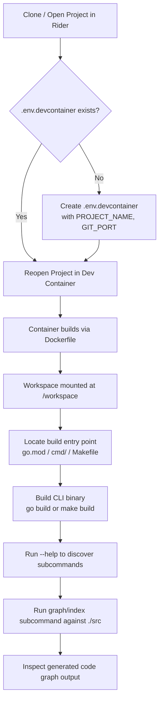

# Codebase Memory CLI — Build & Run Guide

This guide walks through starting the dev container, building the CLI, and
generating a basic code graph for `src`.

## Process Overview



## Runbook

### 1. Prepare Environment File

Create `.env.devcontainer` at the project root if it doesn't exist:

```bash
PROJECT_NAME=codebase-memory-cli
GIT_PORT=47418
```

### 2. Open in Dev Container

In JetBrains Rider:

1. Open the project root.
2. Rider detects `.devcontainer/devcontainer.json` and prompts to reopen in container.
3. Confirm — this triggers `docker-compose` to build/start the `dev` service.

### 3. Verify Workspace Mount

Inside the container terminal:

```bash
cd /workspace
ls
```

Confirm `go.mod`, `src`, and any `cmd/` directory are visible.

### 4. Locate Build Entry Point

```bash
find . -name "main.go" -not -path "*/vendor/*"
cat Makefile 2>/dev/null
```

### 5. Build the CLI

Using Go directly:

```bash
go build -o bin/codebase-memory-cli ./cmd/...
```

Or via Makefile (if present):

```bash
make build
```

### 6. Discover Available Commands

```bash
./bin/codebase-memory-cli --help
```

### 7. Generate a Basic Code Graph

Replace `graph` with the actual subcommand name once confirmed from `--help` output:

```bash
./bin/codebase-memory-cli graph --src ./src --output graph.json
```

### 8. Inspect Output

```bash
cat graph.json | head -n 50
```

## Notes

- Exact subcommand names depend on the CLI's Cobra/argument setup — confirm via `--help`.
- Ports are bound to `127.0.0.1` only (`GIT_PORT`), so access git-daemon locally via `localhost:47418`.
- Named volumes (`claude-workspace`, etc.) persist state between container restarts.

