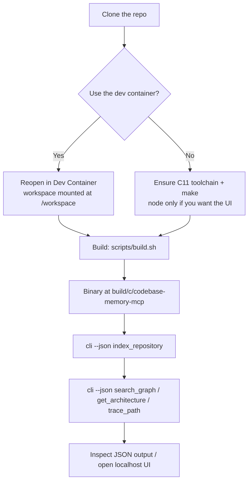

# Codebase Memory CLI — Build & Run Guide

This guide walks through building this **pure-C11** project from source and using it as a local,
network-free CLI to index a repository and query its code graph.

> **This is the CLI-only, no-MCP, no-network fork.** See "About this fork" in the top-level
> [README](../README.md). The codebase was rewritten from Go to **pure C11** at upstream v0.5.0 —
> there is no `go.mod`, no `cmd/`, no Cobra, and no `go build`. Everything is built with
> `scripts/build.sh` / `Makefile.cbm`, and all third-party code (tree-sitter grammars, SQLite,
> yyjson, mimalloc, …) is vendored and compiled in.

## Process Overview



## Runbook

### 1. Prerequisites

- A C11 compiler (clang or gcc) and `make`.
- `node` **only** if you want to bundle the graph-viz UI (`--with-ui`).
- No language runtime and no network access are needed to build or run.

Optionally use the bundled dev container: JetBrains IDEs / VS Code detect
`.devcontainer/devcontainer.json` and offer to reopen the project in the container, where the
workspace is mounted at `/workspace`.

### 2. Build the binary

```bash
# Standard release build
scripts/build.sh
# Output: build/c/codebase-memory-mcp

# Or bundle the localhost graph UI (needs node)
scripts/build.sh --with-ui

# Equivalent make targets
make -f Makefile.cbm cbm            # production binary
make -f Makefile.cbm test           # build with ASan+UBSan and run the test suite
```

> **Fork roadmap:** the dedicated CLI-only artifact `codebase-memory-cli` — built via
> `scripts/build.sh --cli-only` with the MCP server and coordination daemon compiled out behind the
> `CBM_FORK_CLI_ONLY` guard — is tracked on the roadmap (`.claude/planning/active/ROADMAP.md`) and
> not yet available. Use the standard binary and its `cli` subcommand below in the meantime; the
> query behavior is the same.

### 3. Discover the interface

```bash
build/c/codebase-memory-mcp --help
build/c/codebase-memory-mcp cli <tool> --help
```

### 4. Index a repository

```bash
cd /path/to/your/repo
/path/to/build/c/codebase-memory-mcp cli --json index_repository
```

### 5. Query the code graph

```bash
# Structural symbol search (preferred over grep for code)
codebase-memory-mcp cli --json search_graph --query <symbol>

# Module structure / architecture overview
codebase-memory-mcp cli --json get_architecture

# Callers/callees before changing a function
codebase-memory-mcp cli --json trace_path --from <symbol>

# Multi-hop structural questions via Cypher
codebase-memory-mcp cli --json query_graph --query "<cypher>"

# Exact source for one located symbol
codebase-memory-mcp cli --json get_code_snippet --symbol <qualified-name>
```

### 6. Inspect output

`cli --json <tool>` prints the raw result envelope; most tools also accept `--format json` for a
stable per-tool JSON object. Pipe into `jq` for scripting:

```bash
codebase-memory-mcp cli --json get_architecture | jq '.'
```

### 7. Graph UI (localhost only)

Build with `--with-ui`; the UI is served over HTTP on **`127.0.0.1:9749`** (loopback only, CORS/Host
loopback-enforced). In this fork it is started on-demand by the CLI, not by a background daemon; the
dedicated `ui` subcommand is tracked on the roadmap.

## Notes

- This fork makes **no outbound network connections** — no update checks, no telemetry. That
  property is enforced by the project's security audit (`make -f Makefile.cbm security`), which the
  fork tightens to forbid any non-loopback egress.
- The only listening socket is the opt-in localhost graph UI. There is no MCP server and no daemon
  socket.
- Confirm exact subcommand names/flags with `--help`; the tool list and per-tool arguments are the
  source of truth.
